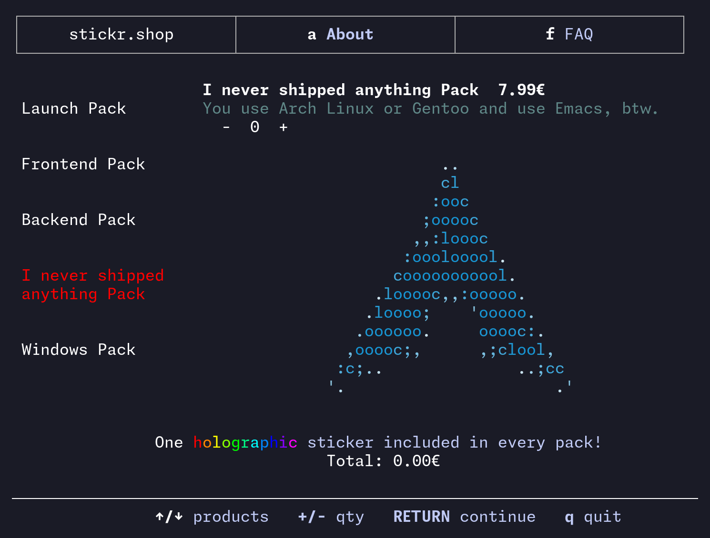

# StickrShop 🖥️💾
Welcome to **Stickr.Shop**, the most _unreasonably_ nerdy sticker shop on the planet! We sling high-quality tech stickers for your laptop, water bottle, or that server rack you call "home." Why click through boring web stores when you can order via SSH like a true terminal warrior? 😎

> _**ssh stickr.shop**_ — because who needs a GUI when you’ve got a CLI?

## What’s the Deal? 🤓
At stickr.shop, we’re obsessed with stickers that scream "I write code at 3 AM and my best friend is a debugger." Think Linux mascots, regex jokes, and that one Kubernetes logo you swear you’ll understand someday. Our shop lets you order stickers by SSH-ing into our server and running commands like you’re hacking the Matrix. It’s chaotic, it’s glorious, it’s us.

## Features That Slap Harder Than a 500 Error

* **SSH Ordering:** `ssh stickr.shop` and flex those command-line skills to cop your stickers.
* **Nerdcore Designs:** From git to Docker whales, we’ve got the stickers your inner geek craves.
* **No Normie Nonsense:** No pastel unicorns here—just raw, unfiltered tech vibes.
* **Fast Shipping:** We yeet your stickers faster than you can say “segmentation fault.”

## Getting Started 🚀

1. **Grab Your Terminal:** Fire up that CLI and SSH into `stickr.shop`.
2. **Run the Magic:** Use our custom TUI to browse and order.
3. **Slap Those Stickers:** Stick ‘em on your gear and watch the normies weep in confusion.

## Issues? Rants? Memes?
Got a bug? Hate our stickers? Wanna send us a meme about YAML? Open an issue here or slide into our DMs on [X](https://x.com/StickrShop). We thrive on chaos.

_Stickr.Shop: Because your laptop deserves to flex as hard as your regex skills. 😜
_
